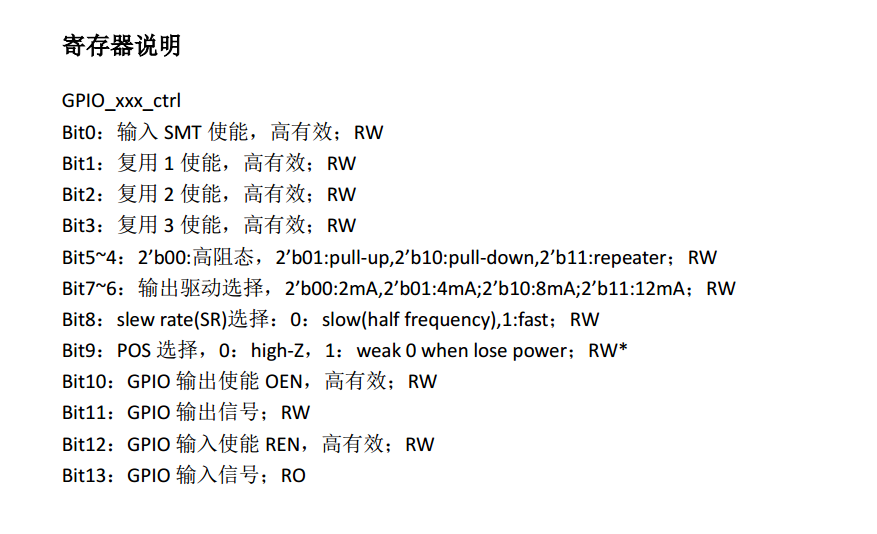
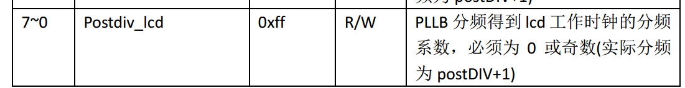

# login
	ifconfig eth0 192.168.20.10
	telnet 192.168.20.10
	root / bs1050adg19

# bootargs
	setenv bootargs mem=80M console=ttyAMA0,115200 root=/dev/mtdblock2 rootfstype=cramfs mtdparts=xm_sfc:256K(boot),1664K(kernel),1152K(romfs),4544K(user),256K(custom),320K(mtd)

# install libs
	sudo apt-get install gcc libncurses5-dev
	sudo apt-get install lib32ncurses5 lib32z1
	sudo apt-get install lib32stdc++6
	
# compile libevent
	export LD_LIBRARY_PATH=/opt/xm_toolchain/arm-xm-linux/usr/lib
 	./configure --prefix=`pwd`/_install  CC=arm-xm-linux-gcc CXX=arm-xm-linux-g++ --host=arm-xm-linux
	make  && make install

# compile ntpdate
	mkdir -p _install
	./configure --prefix=`pwd`/_install --host=arm-xm-linux CC=arm-xm-linux-gcc --with-yielding-select=yes
	make
	make install

# compile kernel
	cp arch/arm/configs/xm530_smp_defconfig .config
	make uImage

# compile busybox
	make defconfig
	make menuconfig #可选的
	make CROSS_COMPILE=arm-xm-linux- CONFIG_PREFIX=_install
	make install

# network config
	ifconfig eth0 hw ether xx:xx:xx:xx:xx:xx;
    ifconfig eth0 xx.xx.xx.xx netmask xx.xx.xx.xx;
    route add default gw xx.xx.xx.xx

# mount nfs
	#install nfs server
	sudo apt-get install nfs-kernel-server

	#nfs server config
	sudo vi /etc/exports

	#add
	/home/heyan  192.168.1.0/24(rw,sync,no_subtree_check,no_root_squash)
	
	#restart
	service nfs-kernel-server restart

	#nfs client mount
	mkdir -p /var/nfs
	mount -t nfs -o nolock -o tcp -o rsize=32768,wsize=32768 192.168.20.196:/home/heyan /var/nfs

# mount emmc
	mkdir -p /var/sd
	mount -t vfat /dev/mmcblk0 /var/sd

# boot script
	/etc/init.d/rcS

# uboot config
	setenv xmuart nfsc 0/1  (0开启串口打印, 1关闭)
	setenv xmauto nfsc 0/1  (0 Sofia不自动运行， 1 Sofia自动运行)
	saveenv (保存环境变量)

# gpio

## cal the register addr.
	基地址0x10020000，如果是gpio71，那么寄存器地址等于基地址加上71 * 4, 即 0x10020000 + 71 * 4.

## disc
 

# lcd

	lcd clk = 1188M / (reg(0x20000044) & 0xff + 1)

 

# video debug

	cd /proc/umap
	cat vo
	cat vi
	cat isp

# mem_dump
 used for capture nv12 pics.
	
	cat /proc/umap/mmz
	# mem_dump addr size
	./mem_dump 0x82911000 0x8f700
	

# audio
	insmod /usr/lib/modules/acodec.ko
	insmod /usr/lib/modules/xm_i2s.ko
	regs 10020120 c00

# isp

 关闭摄像头降噪

	regs 0x30040000 0

# wifi
	ifconfig eth2 up
	wpa_supplicant -c /var/nfs/wpa_wpa2.conf -Dwext -ieth2
	udhcpc -s /usr/sbin/udhcpc.script -i eth2

# uboot-env
	mkenvimage -s 0x10000 -o ~/workspace/uboot.env.bin ~/workspace/uboot.env.txt

# zxing-cpp
	SET(CMAKE_SYSTEM_NAME Linux)
	SET(CMAKE_C_COMPILER   arm-xm-linux-gcc)
	SET(CMAKE_CXX_COMPILER arm-xm-linux-g++)
	set(CMAKE_CXX_STANDARD 11)
	set(CMAKE_CXX_STANDARD_REQUIRED ON)
	add_definitions(-D_GLIBCXX_USE_C99=1)

# upgrade filesystem
	upgrader file XXXXX-all.bin

# drop_caches
	Writing to this file causes the kernel to drop clean caches,dentries and inodes from memory, causing that memory to becomefree.
	To free pagecache, use echo 1 > /proc/sys/vm/drop_caches;
	to free dentries and inodes, use echo 2 > /proc/sys/vm/drop_caches;
	to free pagecache, dentries and inodes, use echo 3 >/proc/sys/vm/drop_caches.
	Because this is a non-destructive operation and dirty objects are not freeable, the user should run sync first

# kill process
	ps -ef | grep fdrserver | grep -v grep |awk '{print $1}' | xargs kill -9
	ps -ef | grep isp | grep -v grep |awk '{print $1}' | xargs kill -9

# flash partition

|partition name	|start		|end		|size(hex)	|size(h)
|---------------|-----------|-----------|-----------|-------
|	uboot		|0x00		|0x30000	|0x30000	|192k	
|	uboot-env	|0x30000	|0x40000	|0x10000	|64k	
|	uImage		|0x40000	|0x1c0000	|0x180000	|1536k	
|	romfs		|0x1c0000	|0x300000	|0x140000	|1280k	
|	user		|0x300000	|0x770000	|0x470000	|4544k	
|	custom		|0x770000	|0x7b0000	|0x40000	|256k	
|	mtd			|0x7b0000	|0x800000	|0x50000	|320k	
